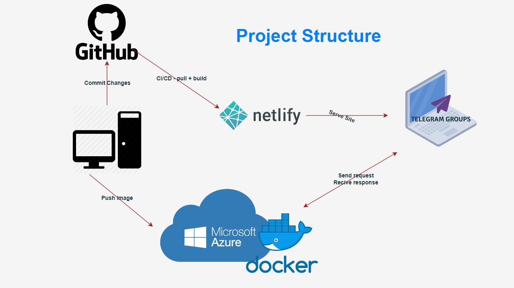
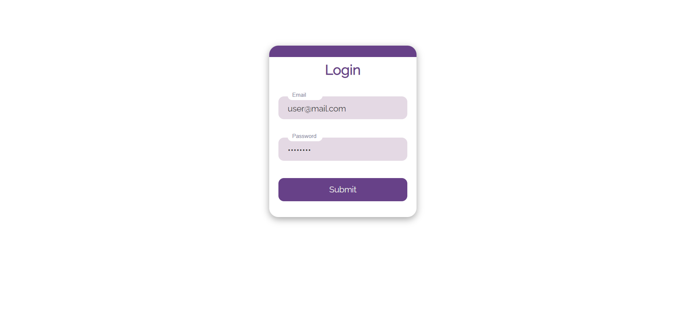
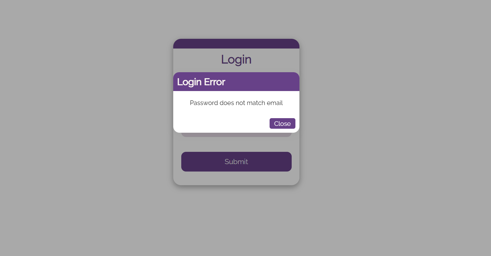
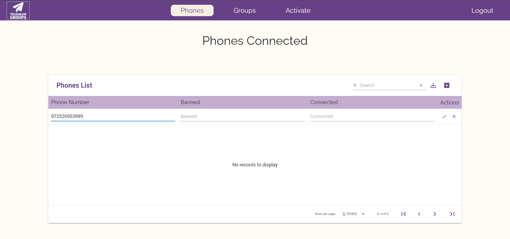
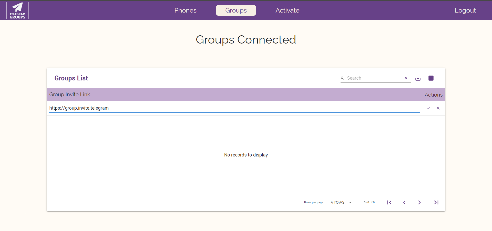
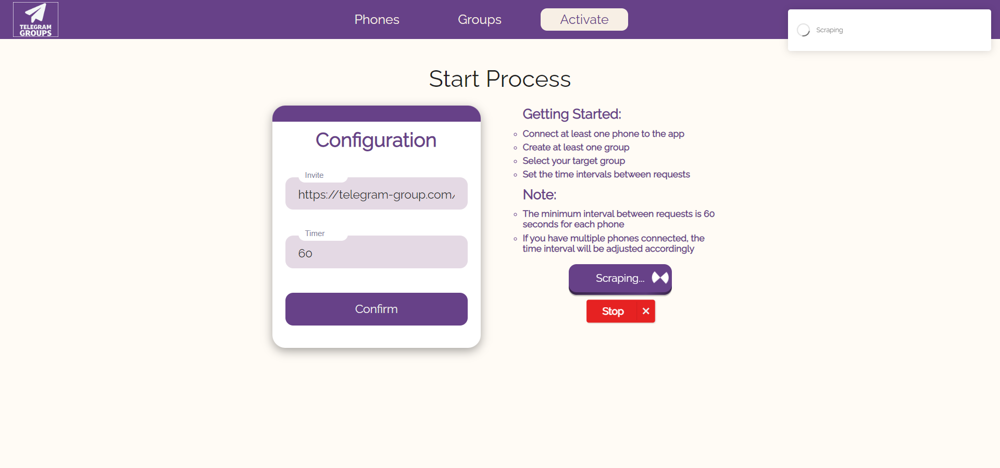
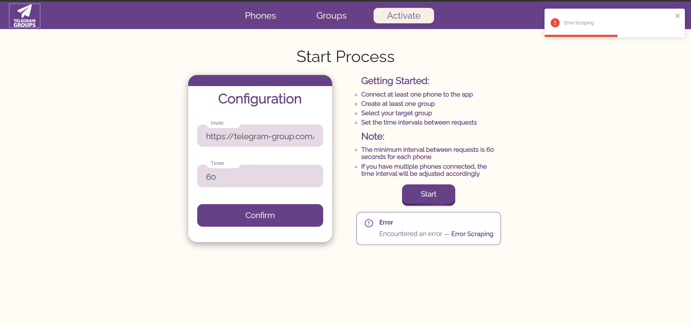

[](https://git.io/typing-svg)

<hr>

 

## I was given a task by a client to build a React app (front-end) with three main pages:

-  Phones Page - This page will enable the user to add/remove phones that will send the invite links(zombies)🧟‍♂️.

-  Groups Page - This page will enable the user to add/edit/remove groups that the app will scrape from.

-  Activate Page - This page will enable the user to config his settings and activate the bot.


## Prerequisites
* BackEnd server configured.
* Set up the api.tsx to have the right api to access your own backend
* Small cup of coffee 😉☕

## App demo link 
[Telegram-App](https://telegram-scraper.netlify.app/)

<br>

# Screenshots:
 

 

 

 


 

 


<br>
<br>

[](https://git.io/typing-svg)

In order to run the app locally you will need to install all the dependencies from the package.json file.  
Run the command ``` npm install ``` to install all the dependencies, after it's done you can run ``` npm start``` to start the app locally in ```localhost:3000```


<br>


# Summary
By going through all the steps and making sure you have the prerequisites you:
- Deployed the app locally with all the dependencies needed.
- Can make calls to the backend and handle the responses from it.
- Should be able to gather tons of users to one telegram group.

<br>

## `Feel free to contact me`:


[](https://www.linkedin.com/in/elad-harel-06ab61183/)
[](mailto:benben95939@gmail.com)
